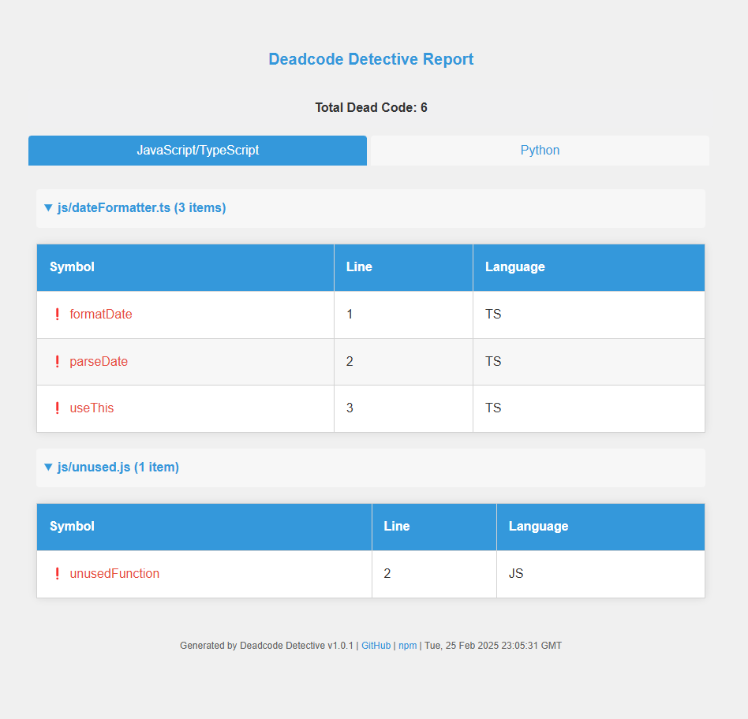
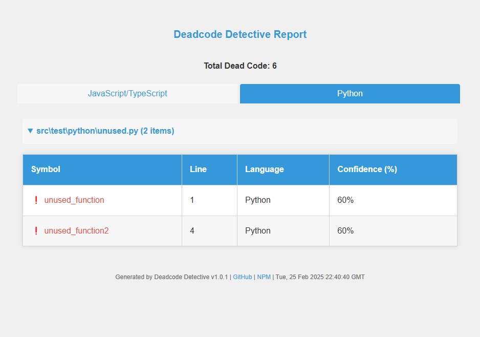

# Deadcode Detective 🔍

**Unmask the silent clutter in your JavaScript, TypeScript, and Python projects.**

Deadcode Detective is a sleek CLI tool that sniffs out unused code—those forgotten functions, variables, and exports lurking in your codebase. Powered by `ts-prune` for JS/TS and `vulture` for Python, it delivers a clear, colorful report to help you keep your projects lean and clean.

[](https://www.npmjs.com/package/deadcode-detective)
[](https://opensource.org/licenses/MIT)


## Why Use It?

Dead code is a silent killer—slowing reviews, bloating builds, and hiding bugs. I’ve been there, untangling large codebases where cleanup was a nightmare. Deadcode Detective fixes that:
- **Multi-Language**: Targets JavaScript, TypeScript, and Python in one tool.
- **Fast & Unified**: Scans in seconds, blending `ts-prune` and `vulture` into a single, polished CLI.
- **Pretty Reports**: Color-coded output that’s easy to read and act on.
- **Actionable**: Pinpoints files, lines, and symbols to zap.


## Installation

Grab it from npm:

```bash
npm install -g deadcode-detective
```

### **Prerequisites**
- **JavaScript/TypeScript**: Install `ts-prune`:

```bash
npm install -g ts-prune
```

- **Python**: Install `vulture`:
```bash
pip install vulture
```


## Usage

Run the `detect` command with paths to scan:
```bash
deadcode-detective detect --py ./src/test/python --confidence 70
```

### **Options**
- `--js <path>`: Scan JavaScript/TypeScript files.
- `--py <path>`: Scan Python files.
- `--confidence <number>`: Confidence threshold for Python dead code detection (0-100, default: 60). Throws an error if above 100 or below 0.
- `--format <type>`: Output format (cli, html, json, default: cli). Use html for web reports, json for machine-readable output, or cli for terminal output.
- `--output <file>`: Output file path (for html or json, defaults to console for json, file 'deadcode-report.<format>' for html).

## Advance Usage with Formats

Generate rich, shareable reports using `--format` and `--output`:
```bash
# HTML report (web view)
deadcode-detective detect --js ./src/test --py ./src/test/python --format html --output report.html

# JSON report (machine-readable)
deadcode-detective detect --js ./src/test --py ./src/test/python --format json --output report.json
```

## Report Example Outputs

### HTML Report Preview
The HTML report offers a visually appealing, interactive view with tabs for different languages and collapsible sections for files. Here’s a sample:

 


Click [here](assests/report.html) to view the HTML report.

### JSON Report Preview
The JSON report provides a structured, machine-readable format for automation or CI/CD integration. Here’s an excerpt:

```json
{
  "js": [
    { 
      "file": "src/test/js/unused.js", 
      "symbol": "unusedFunction", 
      "line": 2, 
      "language": "JS" }
  ],
  "py": [
    { 
      "file": "src/test/python/unused.py", 
      "symbol": "unused_function", 
      "line": 1, 
      "language": "Python", 
      "confidence": 60 }
  ],
  "summary": { 
    "totalDeadCode": 2, 
    "timestamp": "Sun, 23 Feb 2025 18:15:28 UTC" 
    }
}
```
Click [here](assests/report.json) to view the JSON report.

### CLI
Below is the CLI structure which gets printed if no format is selected.

```bash
🔎 Dead Code Report:

❗ Found 2 unused items in JavaScript/TypeScript:
unused.js:
  - unusedFunction (line 2)
dateFormatter.ts:
  - formatDate (line 1)

❗ Found 1 unused item in Python:
script.py:
  - dead_function (line 5)
```

If no dead code is found, you’ll see:
```bash
✅ No dead code found!
```

## Limitations

For JavaScript, a `tsconfig.json` is required for full accuracy. Plain JS support is limited but on the roadmap—stay tuned!

## Try It Out

Clone the repo and test it on the included examples:
```bash
git clone https://github.com/yash9/deadcode-detective.git
cd deadcode-detective
npm install
npm run build
node dist/cli.js detect --js ./src/test/js --py ./src/test/python
```
The `src/test/` folder contains sample JS and Python files with dead code to play with.


## How It Works

- **JS/TS**: Uses `ts-prune` to analyze your `tsconfig.json`-driven project.
- **Python**: Leverages `vulture` with a 60% confidence threshold for reliable detection.
- **Magic**: A dash of TypeScript, commander, chalk, and ora for a smooth CLI experience.

**Coming Soon**: CI/CD integration, JSON/HTML reports, and more!


## Contributing

Love it? Hate it? Want to make it better? **Contributions are welcome!** 🚀  

### Steps to Contribute:
1. **Fork the repository**.
2. **Create a new branch**:  
   ```sh
   git checkout -b my-feature;
   ```
3. Commit changes:
   ```sh
   git commit -m "Add cool thing".
   ```
6. Push:
   ```sh
   git push origin my-feature.
   ```
8. Open a PR!

Check issues for ideas or report bugs.

## License

This project is licensed under the **MIT License** © [Yash](https://github.com/rathi-yash).  

See the [LICENSE](./LICENSE) file for more details.

## Spread the Word

Found this useful? Give it a ⭐ on GitHub or share it with your crew. Let’s banish dead code together! If you’d like to support my work, consider buying me a coffee—every sip fuels more coding!

<a href="https://www.buymeacoffee.com/yash.rathi" target="_blank"></a>

Questions? Hit me up in the issues
